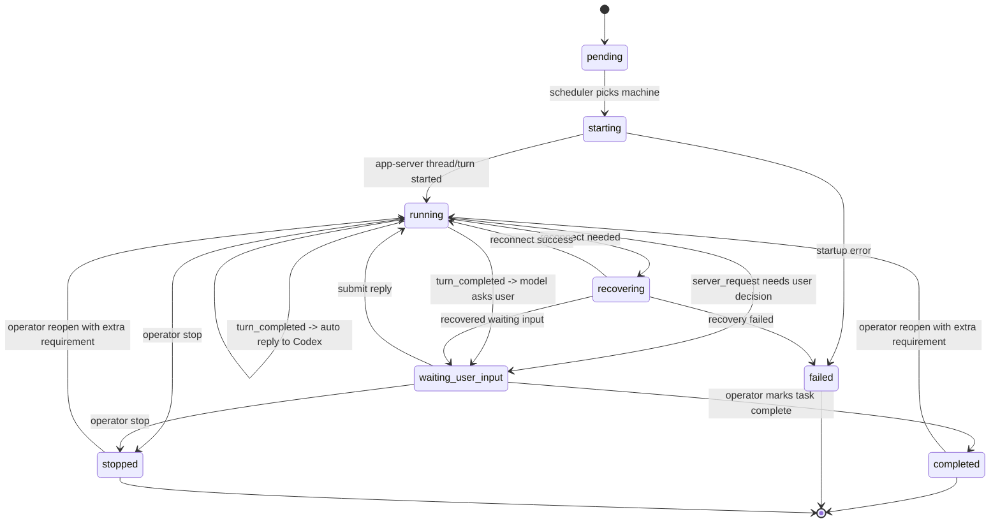

# Alter Ego

Alter Ego is an early-stage AI agent project focused on creating a virtual counterpart of the person who builds and uses it. The goal is to build an agent that can assist with day-to-day work, explore topics of interest, and help investigate the practical boundaries of modern AI systems.

## Lark Assistant

The first integration target is a Lark assistant account. The Go service connects to Lark through WebSocket event subscription, receives text messages, and sends text replies back to the same conversation.

Required environment variables:

```sh
export ALTER_EGO_LARK_APP_ID="cli_xxx"
export ALTER_EGO_LARK_APP_SECRET="xxx"
export ALTER_EGO_LARK_ALLOW_USERS="ou_xxx"
```

Optional environment variables:

```sh
export ALTER_EGO_LARK_DOMAIN="lark"
export ALTER_EGO_LARK_ALLOW_GROUPS="oc_xxx"
export ALTER_EGO_LARK_REQUIRE_MENTION="true"
export ALTER_EGO_LARK_CALLBACK_LISTEN_ADDR=":8080"
export ALTER_EGO_LARK_CALLBACK_PUBLIC_URL="https://callback.example.com"
```

To enable real chat replies instead of the stub handler, configure:

```sh
export ALTER_EGO_LLM_PROVIDER="openai"
export ALTER_EGO_LLM_API_KEY="sk-xxx"
export ALTER_EGO_LLM_BASE_URL="https://api.openai.com/v1"
export ALTER_EGO_LLM_MODEL="gpt-5"
```

For DashScope OpenAI-compatible setups with GLM models, use:

```sh
export ALTER_EGO_LLM_PROVIDER="dashscope"
export ALTER_EGO_LLM_API_KEY="your-dashscope-api-key"
export ALTER_EGO_LLM_BASE_URL="https://dashscope.aliyuncs.com/compatible-mode/v1"
export ALTER_EGO_LLM_MODEL="glm-5.1"
```

Legacy `ALTER_EGO_OPENAI_*` variables are still accepted for backward compatibility.

Supported commands:

- `/help`
- `/status`
- `/reset`
- `/task start <template> <requirement text>`
- `/task list`
- `/task list -a`
- `/task status <task-id>`
- `/task reply <task-id> <decision text>`
- `/task reopen <task-id> <extra requirement>`
- `/task stop <task-id>`
- `/task delete <task-id>`
- `/task delete -a`

## Browser Dashboard

The browser dashboard borrows the visual direction of Mission Control while keeping Alter Ego's Go service as the only authoritative backend.

Current boundaries:

- the frontend is vendored under `web/mission-control/` for UI reuse only;
- browser access requires Lark OAuth;
- dashboard data comes from the live task store and orchestration state;
- task orchestration, Lark bot handling, and browser auth/session state all remain owned by the Go backend.

Browser routes:

- `GET /` protected dashboard shell
- `GET /login` login page
- `GET /auth/lark/start`
- `GET /auth/lark/callback`
- `POST /auth/logout`
- `GET /api/web/session`
- `GET /api/web/dashboard`

Runtime topology:

- `caddy` is the public entrypoint on a configurable browser port
- the Go service serves `/api/*`, `/auth/*`, and `/lark/*`
- the Next.js frontend serves the browser shell for all other paths

Required browser auth environment variables:

```sh
export ALTER_EGO_WEB_PUBLIC_BASE_URL="https://dashboard.example.com"
export ALTER_EGO_WEB_LISTEN_ADDR="127.0.0.1:8080"
export ALTER_EGO_WEB_SESSION_SECRET="change-me"
```

## GitCode Issue Sync

Alter Ego can accept GitCode webhooks and sync issue and merge request state into a Feishu Bitable table. GitCode and Bitable configuration are optional, but they must be enabled together.

GitCode environment variables:

```sh
export ALTER_EGO_GITCODE_WEBHOOK_SECRET="change-me"
export ALTER_EGO_GITCODE_WEBHOOK_VERIFICATION_MODE="token"
export ALTER_EGO_GITCODE_DB_PATH=".alterego/gitcode.db"
```

`ALTER_EGO_GITCODE_WEBHOOK_VERIFICATION_MODE` accepts `token` or `signature`. Use `signature` when GitCode is configured to send `X-GitCode-Signature-256` HMAC headers instead of `X-GitCode-Token`.

Bitable environment variables:

```sh
export ALTER_EGO_BITABLE_APP_ID="cli_xxx"
export ALTER_EGO_BITABLE_APP_SECRET="xxx"
export ALTER_EGO_BITABLE_APP_TOKEN="bascn_xxx"
export ALTER_EGO_BITABLE_TABLE_ID="tblxxx"
export ALTER_EGO_BITABLE_BASE_URL="https://open.feishu.cn"

export ALTER_EGO_BITABLE_FIELD_ISSUE_KEY="IssueKey"
export ALTER_EGO_BITABLE_FIELD_ISSUE_IID="IssueIID"
export ALTER_EGO_BITABLE_FIELD_TITLE="Title"
export ALTER_EGO_BITABLE_FIELD_DESCRIPTION="Description"
export ALTER_EGO_BITABLE_FIELD_STATE="State"
export ALTER_EGO_BITABLE_FIELD_ACTION="Action"
export ALTER_EGO_BITABLE_FIELD_LABELS="Labels"
export ALTER_EGO_BITABLE_FIELD_AUTHOR="Author"
export ALTER_EGO_BITABLE_FIELD_ASSIGNEES="Assignees"
export ALTER_EGO_BITABLE_FIELD_ISSUE_URL="IssueURL"
export ALTER_EGO_BITABLE_FIELD_CREATED_AT="CreatedAt"
export ALTER_EGO_BITABLE_FIELD_UPDATED_AT="UpdatedAt"
export ALTER_EGO_BITABLE_FIELD_LAST_ACTOR="LastActor"
export ALTER_EGO_BITABLE_FIELD_RELATED_PRS="RelatedPRs"
export ALTER_EGO_BITABLE_FIELD_RELATED_PR_URLS="RelatedPRURLs"
export ALTER_EGO_BITABLE_FIELD_RELATED_PR_STATUS="RelatedPRStatus"
export ALTER_EGO_BITABLE_FIELD_LAST_PR_UPDATED_AT="LastPRUpdatedAt"
```

Webhook route:

```text
POST /gitcode/webhook
```

When browser mode is disabled, the route is served from `ALTER_EGO_LARK_CALLBACK_LISTEN_ADDR`. When browser mode is enabled, it is served from `ALTER_EGO_WEB_LISTEN_ADDR`.

## Remote Codex Tasks

Remote Codex orchestration is configured from repository files and persisted in SQLite. Each task runs against a long-lived remote `codex app-server` thread, and Alter Ego drives Codex through the structured app-server protocol instead of scraping terminal output. SSH is still used to bootstrap and proxy the remote app-server process, but the task state source is the app-server thread and turn model.

Unlike the general chat handler, remote task orchestration requires a configured LLM. Deterministic terminal handshakes such as trust prompts and usage-limit prompts are still handled by fixed responders, but every non-deterministic Codex interaction is arbitrated by the configured model. The task subsystem will fail to start if `ALTER_EGO_LLM_API_KEY` or `ALTER_EGO_LLM_MODEL` is missing.

Optional task environment variables:

```sh
export ALTER_EGO_TASK_CONFIG_ROOT="."
export ALTER_EGO_TASK_DB_PATH=".alterego/tasks.db"
```

Configuration layout:

```text
configs/machines/*.yaml
configs/repositories/*.yaml
configs/workspaces/*.yaml
configs/templates/*.yaml
docs/workflows/*.md
```

Repositories optionally document source-control defaults. Workspace profiles define the fixed remote task root, machine pool, and setup strategy. Templates reference a workspace profile with `workspace_id` and attach the workflow document that tells Codex how to execute that kind of task. Task state is stored in the SQLite database defined by `ALTER_EGO_TASK_DB_PATH`.

Remote machine prerequisites:

- `ssh` access from the local control node
- `codex app-server` and `codex remote-control` available on the remote machine
- `codex` installed and already authenticated on the remote machine
- Git access to the configured `remote_repo_url`

Machine configuration can also define a lightweight shell preamble that is injected into every SSH command:

```yaml
id: machine_a
host: build-a.example.com
user: codex
app_server_listen_host: 0.0.0.0
app_server_listen_port: 4317
app_server_service_name: codex-app-server
app_server_install_user: codex
app_server_ws_auth_token: change-me-to-a-long-random-token
shell_init:
  - source /opt/codex/env.sh
```

Use `shell_init` only for idempotent environment setup such as exporting `CODEX_HOME`, toolchain paths, or proxy variables. It is injected into SSH commands and the app-server startup command. Keep repository-specific preparation in `pre_clone_bootstrap` and `post_clone_bootstrap`.

Non-loopback Codex app-server websocket listeners also require websocket auth. Set a per-machine `app_server_ws_auth_token`; Alter Ego will install it onto the remote machine as a capability token file and will connect with `Authorization: Bearer <token>`.

Repository configuration is optional metadata. A repository entry can define:

```yaml
id: repo_backend
display_name: Backend Repo
remote_repo_url: git@github.com:org/repo.git
remote_workspace_root: /srv/codex-tasks
default_branch: main
machine_ids:
  - machine_a
pre_clone_bootstrap:
  - setup-git-auth
post_clone_bootstrap:
  - pnpm install
```

Workspace configuration is the reusable execution profile consumed by templates:

```yaml
id: backend_workspace
display_name: Backend Workspace
root: /srv/codex-tasks
machine_ids:
  - machine_a
setup:
  type: repo
  remote_repo_url: git@github.com:org/repo.git
  checkout_branch: main
  pre_clone_bootstrap:
    - setup-git-auth
  post_clone_bootstrap:
    - pnpm install
```

Template configuration stays focused on the task type and workflow:

```yaml
id: feature_dev
display_name: Feature Development
description: Default feature workflow for scoped repository changes.
task_type: general
workspace_id: backend_workspace
workflow_path: docs/workflows/example-feature-dev.md
```

For each new task, Alter Ego will:

1. choose a machine from the workspace machine pool;
2. create a task directory under `<workspace.root>/<task-id>`;
3. run `pre_clone_bootstrap`;
4. clone the repository;
5. checkout the workspace `checkout_branch`;
6. run `post_clone_bootstrap`;
7. connect to the machine's long-lived Codex app-server websocket endpoint;
8. create a task-scoped app-server thread;
9. start `codex` inside that thread.

The bundled `code_review` template is a structured entry point for PR review work. It carries `task_type: code_review` and a `code_review` config block so Codex receives the GitCode project, PR selector, review tool, humanizer skill, approval channel, and publisher in the initial task input. The current implementation uses the normal task approval loop; a dedicated background PR scanner and automatic GitCode comment publisher can be added on top of this task type without changing the template shape.

Interactive task lifecycle:

1. `pending`
2. `starting`
3. `running`
4. `waiting_user_input` when Codex issues an explicit app-server server request that needs user involvement, or when a completed turn needs a human decision
5. `recovering` when Alter Ego loses contact with the remote app-server thread and is attempting recovery
6. `completed` when the operator explicitly marks the task complete
7. `failed` when startup, recovery, or remote execution cannot continue
8. `stopped` when the operator explicitly stops the task

Task state transitions:



Task list output now uses Lark interactive cards when sent from the Lark channel. Each task card includes action buttons:

- `status` to fetch the current task summary
- `stop` for `running` or `waiting_user_input`
- `delete` for terminal tasks, with a confirm dialog

To receive card action callbacks, expose a local HTTP listener on `ALTER_EGO_LARK_CALLBACK_LISTEN_ADDR` and point the Lark app's card callback URL at `ALTER_EGO_LARK_CALLBACK_PUBLIC_URL + /lark/card/callback`.

Example:

```text
listen addr: :8080
public url:  https://callback.example.com
callback url: https://callback.example.com/lark/card/callback
```

Task state and operator audit data are stored in SQLite:

- `tasks`
- `task_events`
- `task_questions`
- `task_server_requests`

Replies from `/task reply` are injected back into the live remote session rather than starting a new Codex run.

Task decision flow:

1. subscribe to Codex app-server websocket events and keep the latest thread snapshot in memory;
2. persist each explicit app-server server request and handle it exactly once;
3. require every explicit server request to either auto-reply or escalate to the user;
4. require every `turn_completed` event to either auto-reply to Codex or escalate to the user;
5. use the model as a supervisor only for that routing decision, not for inventing extra workflows or completion checks;
6. keep the 2-minute polling loop only for status refresh and optional progress reporting, never for inventing new Codex input.

Run locally:

```sh
CGO_ENABLED=0 go run ./cmd/alterego
```

## Packaging

Generic Linux packaging assets live in `packaging/README.md`. The committed packaging flow builds a `tar.gz` with:

- the Linux `alterego` binary
- `alteregod.service`
- an empty environment template
- example task configuration with valid app-server fields

It intentionally excludes any real secrets or real deployment configuration.

## License

Copyright 2026 yuqitao1024.

This project is licensed under the [Apache License 2.0](LICENSE).
