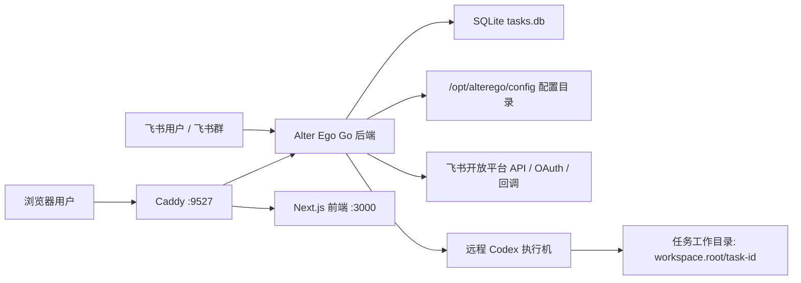

# Alter Ego 安装与部署手册

本文是一份面向实际落地的中文安装部署文档，目标是让第一次接手本项目的人也能按步骤部署成功。

文中会使用当前环境的真实参数作为示例，例如：

- 部署目标机 SSH：`121.41.199.170:20002`
- 浏览器入口：`http://121.41.199.170:9527`

这些值只是示例。你在自己的环境中必须替换成自己的公网 IP、端口、域名、飞书应用信息和 LLM 密钥。

## 1. 项目是什么

Alter Ego 是一个以飞书为交互入口的 AI Agent 系统，核心能力包括：

- 通过飞书机器人接收消息和任务指令。
- 通过 Go 后端维护任务状态、调度逻辑和浏览器登录态。
- 通过浏览器面板查看任务、状态和登录信息。
- 通过远程 Codex 机器执行任务工作流。
- 通过通用任务模板执行开发、研究、代码评审等流程。

当前项目边界也很明确：

- 它不是代码仓托管平台，不负责托管 Git 服务。
- 它不是通用 CI/CD 平台，不替代 Jenkins、GitHub Actions 或 Argo CD。
- 它不是容器编排系统，不负责 Kubernetes 管理。
- 代码评审当前是 `code_review` 任务模板入口，不是独立常驻的 PR 扫描服务。
- 它主要负责“接收请求 -> 编排任务 -> 调用远程执行机 -> 展示结果”这条链路。

## 2. 软件架构



可以把它理解成 3 层：

- 接入层：飞书、浏览器、Caddy。
- 控制层：Alter Ego Go 后端，负责机器人消息、任务编排、Web API、会话与状态管理。
- 执行层：远程 Codex 执行机，负责真正执行任务。

## 3. 角色划分

部署时建议明确区分 3 类机器：

### 3.1 控制机 / 构建机

这是你执行打包和发布脚本的机器，也就是本仓库所在机器。

它需要：

- `git`
- `go` 1.23+
- `node` 22+
- `npm`
- `ssh`
- `scp`

本仓库当前已验证的本地版本示例：

- Go：`1.26.0`
- Node：`22.22.1`
- npm：`9.2.0`

### 3.2 目标部署机

这是最终运行 Alter Ego 服务的 Linux 服务器。

它需要：

- Linux
- `systemd`
- `caddy`
- 可写目录 `/opt`、`/etc`、`/var/lib`
- 允许你通过 SSH 登录
- 登录用户最好是 `root`，或具备无交互 `sudo` 权限

### 3.3 远程任务执行机

这是 Alter Ego 真正下发任务的远程机器，可以和目标部署机相同，也可以分离。

它需要：

- Linux
- `codex`
- `codex app-server`
- `codex remote-control`
- `git`
- 已完成 `codex` 登录
- 能访问目标代码仓库

## 4. 公网地址与端口规划

这一节非常重要。飞书机器人、浏览器登录和卡片回调都依赖公网可达地址。

### 4.1 最少需要的公网能力

- 一个可 SSH 登录的公网地址
- 一个可供浏览器访问的公网地址
- 一个飞书可以主动回调到的公网地址

### 4.2 当前环境示例

- 部署目标机 SSH：`121.41.199.170:20002`
- 浏览器面板入口：`http://121.41.199.170:9527`
- 当前环境中飞书回调曾使用独立地址：`http://121.41.199.170:20000`

### 4.3 推荐做法

推荐把浏览器入口和飞书回调统一走 Caddy，例如：

- `ALTER_EGO_WEB_PUBLIC_BASE_URL=http://<你的公网IP或域名>:9527`
- `ALTER_EGO_LARK_CALLBACK_PUBLIC_URL=http://<你的公网IP或域名>:9527`

这样飞书卡片回调地址就是：

```text
http://<你的公网IP或域名>:9527/lark/card/callback
```

当前仓库中的 Caddy 模板已经把 `/lark/*`、`/api/*`、`/auth/*` 转发给 Go 后端，把其他路径转发给 Next 前端。

### 4.4 默认端口关系

- 公网入口：`9527`
- Go 后端监听：`127.0.0.1:8080`
- Next 前端监听：`127.0.0.1:3000`

如果你修改了这些端口，必须同步修改：

- `/etc/alterego/alterego.env`
- `/etc/alterego/alterego-web.env`
- `/etc/caddy/Caddyfile`

## 5. 飞书应用与机器人准备

本项目推荐使用“企业自建应用 + 机器人能力 + 网页应用/OAuth 登录能力”的方式接入飞书。

不推荐只使用“自定义机器人 webhook”，原因是本项目除了消息收发外，还依赖：

- 飞书身份登录
- 用户信息获取
- 回调处理
- 机器人交互能力

### 5.1 官方入口

以下是飞书官方文档和入口：

- 飞书开放平台首页：<https://open.feishu.cn/>
- 企业自建应用开发流程：<https://open.feishu.cn/document/develop-process/self-built-application-development-process?lang=zh-CN>
- 创建并配置自建应用：<https://open.feishu.cn/document/client-docs/h5/development-guide/step1?lang=zh-CN>
- 浏览器网页登录 / OAuth 流程：<https://open.feishu.cn/document/sso/web-application-sso/login-overview?lang=zh-CN>
- 浏览器应用接入指南：<https://open.feishu.cn/document/common-capabilities/sso/web-application-end-user-consent/guide>
- 卡片交互回调：<https://open.feishu.cn/document/feishu-cards/card-callback-communication?lang=zh-CN>
- 自定义机器人说明：<https://open.feishu.cn/document/client-docs/bot-v3/add-custom-bot?lang=zh-CN>

说明：

- 本项目主要使用的是“应用机器人”，不是只发 webhook 的“自定义机器人”。
- 上面的自定义机器人链接仅用于帮助你理解飞书机器人体系差异。

### 5.2 你至少需要在飞书后台完成的配置

1. 创建企业自建应用。
2. 开启机器人能力。
3. 开启网页应用或登录相关能力。
4. 配置重定向地址。
5. 配置事件与回调。
6. 申请应用所需权限。
7. 获取 `App ID` 和 `App Secret`。

### 5.3 本项目中会用到的飞书参数

你最终至少要准备：

- `ALTER_EGO_LARK_APP_ID`
- `ALTER_EGO_LARK_APP_SECRET`
- `ALTER_EGO_LARK_ALLOW_USERS`

通常还会配置：

- `ALTER_EGO_LARK_ALLOW_GROUPS`
- `ALTER_EGO_LARK_CALLBACK_LISTEN_ADDR`
- `ALTER_EGO_LARK_CALLBACK_PUBLIC_URL`
- `ALTER_EGO_LARK_REQUIRE_MENTION`

## 6. 目录与配置文件约定

### 6.1 部署后目标机上的目录

- 程序目录：`/opt/alterego`
- 环境变量目录：`/etc/alterego`
- 数据库目录：`/var/lib/alterego`
- systemd 单元：`/etc/systemd/system`
- Caddy 配置：`/etc/caddy/Caddyfile`

### 6.2 仓库内的任务配置目录

仓库内以下目录会被打包并发布：

```text
configs/machines/*.yaml
configs/repositories/*.yaml
configs/workspaces/*.yaml
configs/templates/*.yaml
docs/workflows/*.md
```

> 注意
>
> `packaging/local/build-real-package.sh` 会把这些目录下所有非 `example` 文件一起打包。
> 这包括本地未跟踪文件。
> 所以打包前请先确认这些文件就是你要部署到线上环境的版本。

### 6.3 最小配置文件集合

首次部署至少要准备：

- 机器配置：`configs/machines/<你的机器名>.yaml`
- 工作区配置：`configs/workspaces/<你的工作区名>.yaml`
- 模板配置：`configs/templates/<你的模板名>.yaml`
- 工作流文档：`docs/workflows/<你的流程名>.md`

`configs/repositories/*.yaml` 可以继续作为仓库默认信息的记录，但新模板主要通过 `workspace_id` 绑定工作区，不要求配置 `repository_id`。

## 7. 安装部署步骤

以下步骤按顺序执行。

### 第 1 步：准备控制机环境

在控制机上确认工具齐全：

```bash
git --version
go version
node -v
npm -v
ssh -V
scp -V
```

要求：

- Go 版本不低于 `1.23`
- Node 版本不低于 `22`

### 第 2 步：获取项目代码

```bash
git clone <你的仓库地址>
cd alter-ego
```

如果你已经有代码，直接进入仓库根目录即可。

### 第 3 步：准备本地部署环境变量文件

`packaging/local/` 已被 `.gitignore` 忽略，适合放本地真实部署参数。

创建文件：

```bash
mkdir -p packaging/local
```

新建 `packaging/local/deploy.env`，内容可参考：

```bash
export ALTER_EGO_LARK_APP_ID="cli_xxx"
export ALTER_EGO_LARK_APP_SECRET="xxx"
export ALTER_EGO_LARK_DOMAIN="https://open.feishu.cn"
export ALTER_EGO_LARK_ALLOW_USERS="ou_xxx,ou_yyy"
export ALTER_EGO_LARK_ALLOW_GROUPS="oc_xxx,oc_yyy"
export ALTER_EGO_LARK_REQUIRE_MENTION="true"

export ALTER_EGO_LARK_CALLBACK_LISTEN_ADDR=":8080"

# 推荐写成和浏览器入口一致的公网地址；必须替换成你自己的值
export ALTER_EGO_LARK_CALLBACK_PUBLIC_URL="http://<你的公网IP或域名>:9527"

# 必须替换成你自己的值
export ALTER_EGO_WEB_PUBLIC_BASE_URL="http://<你的公网IP或域名>:9527"
export ALTER_EGO_WEB_SESSION_SECRET="replace-with-a-long-random-secret"

export ALTER_EGO_LLM_PROVIDER="openai"
export ALTER_EGO_LLM_API_KEY="sk-xxx"
export ALTER_EGO_LLM_BASE_URL="https://api.openai.com/v1"
export ALTER_EGO_LLM_MODEL="gpt-5"

export ALTER_EGO_TASK_PROGRESS_REPORTS_ENABLED="false"

# 部署目标机 SSH 信息，必须替换成你自己的值
export ALTEREGO_DEPLOY_TARGET="root@121.41.199.170"
export ALTEREGO_DEPLOY_PORT="20002"
```

载入环境变量：

```bash
set -a
source packaging/local/deploy.env
set +a
```

> 注意
>
> 发布脚本会把当前 shell 中的环境变量写入新的 `/etc/alterego/alterego.env` 和 `/etc/alterego/alterego-web.env`，
> 然后覆盖远端同名文件。
> 所以执行部署前，必须确认当前 shell 里加载的是正确的线上配置。

### 第 4 步：准备任务配置文件

从 example 文件复制一份自己的配置：

```bash
cp configs/machines/example.yaml configs/machines/my-machine.yaml
cp configs/workspaces/example.yaml configs/workspaces/my-workspace.yaml
cp configs/templates/example.yaml configs/templates/my-template.yaml
cp docs/workflows/example-feature-dev.md docs/workflows/my-workflow.md
```

#### 4.1 机器配置示例

```yaml
id: machine_a
display_name: Primary Build Machine
host: build-a.example.com
port: 22
user: codex
app_server_listen_host: 0.0.0.0
app_server_listen_port: 4317
app_server_service_name: codex-app-server
app_server_install_user: codex
app_server_ws_auth_token: change-me-to-a-long-random-token
shell_init:
  - source /opt/codex/env.sh
```

需要重点替换：

- `host`
- `port`
- `user`
- `app_server_*`
- `app_server_ws_auth_token`

#### 4.2 仓库配置示例

```yaml
id: repo_backend
display_name: Backend Repo
remote_repo_url: git@github.com:example/backend.git
remote_workspace_root: /srv/codex-tasks
default_branch: main
machine_ids:
  - machine_a
pre_clone_bootstrap:
  - setup-git-auth
post_clone_bootstrap:
  - git submodule update --init --recursive
```

需要重点替换：

- `remote_repo_url`
- `remote_workspace_root`
- `default_branch`
- `machine_ids`

#### 4.3 工作区配置示例

```yaml
id: backend_workspace
display_name: Backend Workspace
description: Shared checkout workspace for backend development tasks.
root: /srv/codex-tasks
machine_ids:
  - machine_a
setup:
  type: repo
  remote_repo_url: git@github.com:example/backend.git
  checkout_branch: main
  pre_clone_bootstrap:
    - setup-git-auth
  post_clone_bootstrap:
    - git submodule update --init --recursive
```

需要重点替换：

- `id`
- `root`
- `machine_ids`
- `setup.remote_repo_url`
- `setup.checkout_branch`

#### 4.4 模板配置示例

```yaml
id: feature_dev
display_name: Feature Development
description: Default feature workflow for scoped repository changes.
task_type: general
workspace_id: backend_workspace
workflow_path: docs/workflows/my-workflow.md
```

需要重点替换：

- `task_type`
- `workspace_id`
- `workflow_path`

#### 4.5 代码评审模板示例

```yaml
id: code_review
display_name: Code Review
description: Review the latest open GitCode pull request and request approval before publishing comments.
task_type: code_review
workspace_id: backend_workspace
code_review:
  gitcode_project: example/backend
  pr_selector: latest_open
  review_tool: codex_builtin
  humanizer_skill: humanizer:humanizer
  approval: lark
  publisher: gitcode
workflow_path: docs/workflows/code-review.md
```

注意：这里的 `gitcode_project`、`workspace_id` 和 `workflow_path` 都要替换成你自己的项目与流程。

#### 4.6 工作流文档示例

```md
# Example Feature Development Workflow

1. Confirm the request scope, the contents already prepared in the task workspace, and the expected output.
2. Inspect the current workspace contents and identify the minimal change set needed for the task.
3. Write or update tests before changing production code when the workspace includes executable code.
4. Implement the change and keep the work focused on the requested behavior.
5. Run the relevant verification commands from the task workspace and capture the result.
6. Summarize the change, risks, and any follow-up work for the operator.
```

### 第 5 步：检查目标部署机基础条件

登录目标机：

```bash
ssh -p 20002 root@121.41.199.170
```

把上面的地址替换成你自己的目标机。

在目标机检查：

```bash
systemctl --version
caddy version
mkdir -p /opt /etc/alterego /var/lib/alterego
```

如果 `caddy` 不存在，请先安装并确保 systemd 能管理它。

### 第 6 步：本地打包

在控制机仓库根目录执行：

```bash
set -a
source packaging/local/deploy.env
set +a

packaging/local/build-real-package.sh
```

成功后会输出一个包路径，例如：

```text
dist/local/alterego-real-linux-amd64-<version>.tar.gz
```

这个打包过程会自动完成：

- 编译 Go 后端
- 构建 Next 前端
- 生成 `alterego.env`
- 生成 `alterego-web.env`
- 打包配置文件和 workflow

### 第 7 步：执行发布

直接执行：

```bash
set -a
source packaging/local/deploy.env
set +a

packaging/local/deploy-real-package.sh
```

该脚本会自动：

- 通过 SSH/SCP 上传发布包
- 解压到远端临时目录
- 替换 `/opt/alterego`
- 覆盖 `/etc/alterego/alterego.env`
- 覆盖 `/etc/alterego/alterego-web.env`
- 覆盖 systemd 服务文件
- 覆盖 `/etc/caddy/Caddyfile`
- `systemctl daemon-reload`
- 重启 `alteregod`
- 重启 `alterego-web`
- 重载或重启 `caddy`

### 第 8 步：检查服务状态

在目标机执行：

```bash
systemctl --no-pager --full status alteregod
systemctl --no-pager --full status alterego-web
systemctl --no-pager --full status caddy
```

如果都正常，应该看到 `active (running)`。

### 第 9 步：检查 HTTP 访问

在目标机执行：

```bash
curl -I http://127.0.0.1:8080/
curl -I http://127.0.0.1:3000/
curl -I http://127.0.0.1:9527/
```

常见成功表现：

- 后端返回 `302`
- 前端返回 `307`
- Caddy 转发后的公网入口也返回到 `/login` 的重定向

然后在浏览器中打开：

```text
http://<你的公网IP或域名>:9527/login
```

当前示例环境的访问地址是：

```text
http://121.41.199.170:9527/login
```

### 第 10 步：检查飞书回调和机器人配置

如果你使用统一入口方式，那么飞书后台中卡片回调地址建议配置为：

```text
http://<你的公网IP或域名>:9527/lark/card/callback
```

如果你使用独立回调入口，也可以配置成：

```text
http://<你的回调公网IP或域名>:<你的回调端口>/lark/card/callback
```

请确保：

- 飞书后台中的回调地址和 `ALTER_EGO_LARK_CALLBACK_PUBLIC_URL` 一致
- 该地址公网可访问
- 该地址最终能到达 Go 后端

## 8. 部署完成后的验收清单

建议逐项确认：

1. 浏览器能打开 `/login`
2. 飞书 OAuth 登录能跳转并返回
3. 飞书机器人能收到消息
4. `/help`、`/status` 能返回
5. 浏览器面板能正常显示
6. 创建任务后，数据库中能看到任务记录
7. 远程执行机能创建任务工作目录

## 9. 常用运维命令

### 查看服务状态

```bash
systemctl status alteregod
systemctl status alterego-web
systemctl status caddy
```

### 查看日志

```bash
journalctl -u alteregod -n 100 --no-pager
journalctl -u alterego-web -n 100 --no-pager
journalctl -u caddy -n 100 --no-pager
```

### 重启服务

```bash
systemctl restart alteregod
systemctl restart alterego-web
systemctl restart caddy
```

### 查看环境文件

```bash
sed -n '1,200p' /etc/alterego/alterego.env
sed -n '1,200p' /etc/alterego/alterego-web.env
```

## 10. 常见问题

### 10.1 `database is locked` / `SQLITE_BUSY`

现象：

- 日志中出现 `database is locked`
- task 状态更新失败

排查方向：

- 是否有异常任务进程未正确退出
- 是否多处并发访问同一个 SQLite 文件
- 是否历史任务状态异常，导致密集重试

优先检查：

```bash
journalctl -u alteregod -n 200 --no-pager
ls -l /var/lib/alterego/tasks.db
```

### 10.2 LLM 返回 `401 Invalid token`

现象：

- 任务启动了，但分类或决策阶段报 `401 Invalid token`

通常原因：

- `ALTER_EGO_LLM_API_KEY` 错误
- `ALTER_EGO_LLM_BASE_URL` 错误
- `ALTER_EGO_LLM_MODEL` 与当前服务商不匹配

先检查：

```bash
sed -n '1,200p' /etc/alterego/alterego.env
journalctl -u alteregod -n 200 --no-pager
```

### 10.3 页面能打开，但飞书登录失败

重点检查：

- `ALTER_EGO_WEB_PUBLIC_BASE_URL` 是否正确
- 飞书后台重定向地址是否正确
- 应用权限是否已申请
- 公网地址是否能从飞书侧访问

### 10.4 飞书卡片按钮点击没有反应

重点检查：

- 飞书后台卡片回调地址是否正确
- `ALTER_EGO_LARK_CALLBACK_PUBLIC_URL` 是否正确
- `/lark/card/callback` 是否确实能到达后端
- Caddy 是否正确转发 `/lark/*`

### 10.5 页面出现 “Failed to find Server Action”

这通常说明前后端版本不一致，或者浏览器还在使用旧页面资源。

处理方式：

- 重新执行完整打包和部署
- 确保后端和前端来自同一版本
- 清浏览器缓存后重试

## 11. 当前项目的推荐部署方式

结合当前仓库脚本，推荐做法是：

1. 在控制机维护本地忽略文件 `packaging/local/deploy.env`
2. 在仓库内维护真实的 `configs/machines`、`configs/workspaces`、`configs/templates` 和 `docs/workflows`
3. 每次发布前先 `source packaging/local/deploy.env`
4. 运行 `packaging/local/deploy-real-package.sh`
5. 发布后立即检查 `systemctl`、`journalctl` 和 `curl`

如果你按照本文档的步骤执行，且飞书应用、LLM 密钥、公网地址、远程 Codex 机器都配置正确，当前项目可以完整跑通：

- 飞书消息入口
- 浏览器登录入口
- 任务创建
- 任务远程执行
- 状态查看与日志排查

## 12. 附录：本地真实打包脚本

下面附上当前使用的两个本地脚本内容。

说明：

- 这两个脚本默认放在 `packaging/local/`
- `packaging/local/` 在当前仓库中被 `.gitignore` 忽略
- 如果你的仓库里没有这两个文件，可以按下面内容自行创建

### 12.1 `packaging/local/build-real-package.sh`

```bash
#!/usr/bin/env bash
set -euo pipefail

export LC_ALL=C
export LANG=C

ROOT_DIR="$(cd "$(dirname "${BASH_SOURCE[0]}")/../.." && pwd)"
PACKAGE_NAME="${PACKAGE_NAME:-alterego}"
GOOS="${GOOS:-linux}"
GOARCH="${GOARCH:-amd64}"
VERSION="${VERSION:-$(git -C "${ROOT_DIR}" rev-parse --short HEAD)-local}"
OUTPUT_DIR="${OUTPUT_DIR:-${ROOT_DIR}/dist/local}"
TMP_DIR="$(mktemp -d "${TMPDIR:-/tmp}/alterego-real-package.XXXXXX")"
STAGE_DIR="${TMP_DIR}/${PACKAGE_NAME}"
WEB_BUILD_DIR="${TMP_DIR}/web-build"
ARCHIVE_NAME="${PACKAGE_NAME}-real-${GOOS}-${GOARCH}-${VERSION}.tar.gz"
ARCHIVE_PATH="${OUTPUT_DIR}/${ARCHIVE_NAME}"

cleanup() {
	rm -rf "${TMP_DIR}"
}
trap cleanup EXIT

require_env() {
	local name="$1"
	if [ -z "${!name:-}" ]; then
		printf 'missing required environment variable: %s\n' "${name}" >&2
		exit 1
	fi
}

write_env_var() {
	local file="$1"
	local name="$2"
	local value="${3:-}"
	printf '%s=%s\n' "${name}" "${value}" >> "${file}"
}

copy_tree_without_examples() {
	local src_dir="$1"
	local dst_dir="$2"
	find "${src_dir}" -maxdepth 1 -type f -name '*.yaml' ! -name 'example*.yaml' -print0 | while IFS= read -r -d '' file; do
		cp "${file}" "${dst_dir}/$(basename "${file}")"
	done
}

copy_workflows_without_examples() {
	local src_dir="$1"
	local dst_dir="$2"
	find "${src_dir}" -maxdepth 1 -type f -name '*.md' ! -name 'example*.md' -print0 | while IFS= read -r -d '' file; do
		cp "${file}" "${dst_dir}/$(basename "${file}")"
	done
}

copy_web_source() {
	local src_dir="$1"
	local dst_dir="$2"

	mkdir -p "${dst_dir}"
	(
		cd "${src_dir}"
		find . \
			-path './node_modules' -prune -o \
			-path './.next' -prune -o \
			-type f -print
	) | while IFS= read -r file; do
		mkdir -p "${dst_dir}/$(dirname "${file}")"
		cp "${src_dir}/${file}" "${dst_dir}/${file}"
	done
}

require_env ALTER_EGO_LARK_APP_ID
require_env ALTER_EGO_LARK_APP_SECRET
require_env ALTER_EGO_LARK_ALLOW_USERS
require_env ALTER_EGO_LLM_API_KEY
require_env ALTER_EGO_LLM_MODEL

mkdir -p \
	"${STAGE_DIR}/opt/alterego/bin" \
	"${STAGE_DIR}/opt/alterego/config/configs/machines" \
	"${STAGE_DIR}/opt/alterego/config/configs/repositories" \
	"${STAGE_DIR}/opt/alterego/config/configs/workspaces" \
	"${STAGE_DIR}/opt/alterego/config/configs/templates" \
	"${STAGE_DIR}/opt/alterego/config/docs/workflows" \
	"${STAGE_DIR}/opt/alterego/web" \
	"${STAGE_DIR}/etc/alterego" \
	"${STAGE_DIR}/etc/caddy" \
	"${STAGE_DIR}/etc/systemd/system" \
	"${STAGE_DIR}/var/lib/alterego" \
	"${OUTPUT_DIR}"

(
	cd "${ROOT_DIR}"
	CGO_ENABLED=0 GOOS="${GOOS}" GOARCH="${GOARCH}" go build -o "${STAGE_DIR}/opt/alterego/bin/alterego" ./cmd/alterego
)

copy_web_source "${ROOT_DIR}/web/mission-control" "${WEB_BUILD_DIR}"
mkdir -p "${WEB_BUILD_DIR}/public"
(
	cd "${WEB_BUILD_DIR}"
	npm ci >&2
	npm run build >&2
)

chmod +x "${STAGE_DIR}/opt/alterego/bin/alterego"

cp "${ROOT_DIR}/packaging/templates/alteregod.service" "${STAGE_DIR}/etc/systemd/system/alteregod.service"
cp "${ROOT_DIR}/packaging/templates/alterego-web.service" "${STAGE_DIR}/etc/systemd/system/alterego-web.service"
cp "${ROOT_DIR}/README.md" "${STAGE_DIR}/opt/alterego/README.md"
cp "${ROOT_DIR}/LICENSE" "${STAGE_DIR}/opt/alterego/LICENSE"
cp "${ROOT_DIR}/packaging/templates/Caddyfile" "${STAGE_DIR}/etc/caddy/Caddyfile"
mkdir -p "${STAGE_DIR}/opt/alterego/web/mission-control/.next"
cp -R "${WEB_BUILD_DIR}/.next/standalone/." "${STAGE_DIR}/opt/alterego/web/mission-control/"
cp -R "${WEB_BUILD_DIR}/.next/static" "${STAGE_DIR}/opt/alterego/web/mission-control/.next/static"
mkdir -p "${STAGE_DIR}/opt/alterego/web/mission-control/public"
cp -R "${WEB_BUILD_DIR}/public/." "${STAGE_DIR}/opt/alterego/web/mission-control/public/" 2>/dev/null || true
cp "${WEB_BUILD_DIR}/LICENSE" "${STAGE_DIR}/opt/alterego/web/mission-control/LICENSE"
cp "${WEB_BUILD_DIR}/UPSTREAM.md" "${STAGE_DIR}/opt/alterego/web/mission-control/UPSTREAM.md"

copy_tree_without_examples "${ROOT_DIR}/configs/machines" "${STAGE_DIR}/opt/alterego/config/configs/machines"
copy_tree_without_examples "${ROOT_DIR}/configs/repositories" "${STAGE_DIR}/opt/alterego/config/configs/repositories"
copy_tree_without_examples "${ROOT_DIR}/configs/workspaces" "${STAGE_DIR}/opt/alterego/config/configs/workspaces"
copy_tree_without_examples "${ROOT_DIR}/configs/templates" "${STAGE_DIR}/opt/alterego/config/configs/templates"
copy_workflows_without_examples "${ROOT_DIR}/docs/workflows" "${STAGE_DIR}/opt/alterego/config/docs/workflows"

ENV_FILE="${STAGE_DIR}/etc/alterego/alterego.env"
: > "${ENV_FILE}"

WEB_ENV_FILE="${STAGE_DIR}/etc/alterego/alterego-web.env"
: > "${WEB_ENV_FILE}"

write_env_var "${ENV_FILE}" ALTER_EGO_LARK_APP_ID "${ALTER_EGO_LARK_APP_ID}"
write_env_var "${ENV_FILE}" ALTER_EGO_LARK_APP_SECRET "${ALTER_EGO_LARK_APP_SECRET}"
write_env_var "${ENV_FILE}" ALTER_EGO_LARK_DOMAIN "${ALTER_EGO_LARK_DOMAIN:-https://open.feishu.cn}"
write_env_var "${ENV_FILE}" ALTER_EGO_LARK_CALLBACK_LISTEN_ADDR "${ALTER_EGO_LARK_CALLBACK_LISTEN_ADDR:-:8080}"
write_env_var "${ENV_FILE}" ALTER_EGO_LARK_CALLBACK_PUBLIC_URL "${ALTER_EGO_LARK_CALLBACK_PUBLIC_URL:-}"
write_env_var "${ENV_FILE}" ALTER_EGO_LARK_ALLOW_USERS "${ALTER_EGO_LARK_ALLOW_USERS}"
write_env_var "${ENV_FILE}" ALTER_EGO_LARK_ALLOW_GROUPS "${ALTER_EGO_LARK_ALLOW_GROUPS:-}"
write_env_var "${ENV_FILE}" ALTER_EGO_LARK_REQUIRE_MENTION "${ALTER_EGO_LARK_REQUIRE_MENTION:-true}"
write_env_var "${ENV_FILE}" ALTER_EGO_WEB_PUBLIC_BASE_URL "${ALTER_EGO_WEB_PUBLIC_BASE_URL:-https://dashboard.example.com}"
write_env_var "${ENV_FILE}" ALTER_EGO_WEB_LISTEN_ADDR "${ALTER_EGO_WEB_LISTEN_ADDR:-127.0.0.1:8080}"
write_env_var "${ENV_FILE}" ALTER_EGO_WEB_SESSION_SECRET "${ALTER_EGO_WEB_SESSION_SECRET:-change-me}"

write_env_var "${ENV_FILE}" ALTER_EGO_LLM_PROVIDER "${ALTER_EGO_LLM_PROVIDER:-openai}"
write_env_var "${ENV_FILE}" ALTER_EGO_LLM_API_KEY "${ALTER_EGO_LLM_API_KEY}"
write_env_var "${ENV_FILE}" ALTER_EGO_LLM_BASE_URL "${ALTER_EGO_LLM_BASE_URL:-https://api.openai.com/v1}"
write_env_var "${ENV_FILE}" ALTER_EGO_LLM_MODEL "${ALTER_EGO_LLM_MODEL}"

write_env_var "${ENV_FILE}" ALTER_EGO_TASK_CONFIG_ROOT "/opt/alterego/config"
write_env_var "${ENV_FILE}" ALTER_EGO_TASK_DB_PATH "/var/lib/alterego/tasks.db"
write_env_var "${ENV_FILE}" ALTER_EGO_TASK_PROGRESS_REPORTS_ENABLED "${ALTER_EGO_TASK_PROGRESS_REPORTS_ENABLED:-false}"

write_env_var "${WEB_ENV_FILE}" PORT "${ALTER_EGO_WEB_FRONTEND_PORT:-3000}"
write_env_var "${WEB_ENV_FILE}" HOSTNAME "${ALTER_EGO_WEB_FRONTEND_HOSTNAME:-127.0.0.1}"
write_env_var "${WEB_ENV_FILE}" INTERNAL_API_BASE_URL "${ALTER_EGO_WEB_INTERNAL_API_BASE_URL:-http://127.0.0.1:8080}"

tar -C "${TMP_DIR}" -czf "${ARCHIVE_PATH}" "${PACKAGE_NAME}"

printf '%s\n' "${ARCHIVE_PATH}"
```

### 12.2 `packaging/local/deploy-real-package.sh`

```bash
#!/usr/bin/env bash
set -euo pipefail

ROOT_DIR="$(cd "$(dirname "${BASH_SOURCE[0]}")/../.." && pwd)"
SSH_TARGET="${ALTEREGO_DEPLOY_TARGET:-}"
SSH_PORT="${ALTEREGO_DEPLOY_PORT:-22}"
REMOTE_TMP_DIR="${ALTEREGO_REMOTE_TMP_DIR:-/tmp/alterego-deploy}"

if [ -z "${SSH_TARGET}" ]; then
	printf 'missing required environment variable: ALTEREGO_DEPLOY_TARGET\n' >&2
	exit 1
fi

if [ -n "${ALTEREGO_PACKAGE_PATH:-}" ]; then
	ARCHIVE_PATH="${ALTEREGO_PACKAGE_PATH}"
else
	ARCHIVE_PATH="$("${ROOT_DIR}/packaging/local/build-real-package.sh")"
fi

run_remote() {
	local command="$1"
	if [ "${SSH_PORT}" = "22" ]; then
		ssh "${SSH_TARGET}" "${command}"
	else
		ssh -p "${SSH_PORT}" "${SSH_TARGET}" "${command}"
	fi
}

copy_remote() {
	local source_path="$1"
	local target_path="$2"
	if [ "${SSH_PORT}" = "22" ]; then
		scp "${source_path}" "${target_path}"
	else
		scp -P "${SSH_PORT}" "${source_path}" "${target_path}"
	fi
}

run_remote "set -euo pipefail; rm -rf '${REMOTE_TMP_DIR}'; mkdir -p '${REMOTE_TMP_DIR}'"
copy_remote "${ARCHIVE_PATH}" "${SSH_TARGET}:${REMOTE_TMP_DIR}/package.tar.gz"

run_remote "
	set -euo pipefail
	rm -rf '${REMOTE_TMP_DIR}/root'
	mkdir -p '${REMOTE_TMP_DIR}/root'
	tar -xzf '${REMOTE_TMP_DIR}/package.tar.gz' -C '${REMOTE_TMP_DIR}/root'
	mkdir -p /opt /etc/alterego /etc/systemd/system /var/lib/alterego
	rm -rf /opt/alterego
	cp -R '${REMOTE_TMP_DIR}/root/alterego/opt/alterego' /opt/alterego
	cp '${REMOTE_TMP_DIR}/root/alterego/etc/systemd/system/alteregod.service' /etc/systemd/system/alteregod.service
	cp '${REMOTE_TMP_DIR}/root/alterego/etc/systemd/system/alterego-web.service' /etc/systemd/system/alterego-web.service
	cp '${REMOTE_TMP_DIR}/root/alterego/etc/alterego/alterego.env' /etc/alterego/alterego.env
	cp '${REMOTE_TMP_DIR}/root/alterego/etc/alterego/alterego-web.env' /etc/alterego/alterego-web.env
	mkdir -p /etc/caddy
	cp '${REMOTE_TMP_DIR}/root/alterego/etc/caddy/Caddyfile' /etc/caddy/Caddyfile
	systemctl daemon-reload
	systemctl enable alteregod
	systemctl enable alterego-web
	systemctl enable caddy || true
	systemctl restart alteregod
	systemctl restart alterego-web
	systemctl reload caddy || systemctl restart caddy || true
	systemctl --no-pager --full status alteregod || true
	systemctl --no-pager --full status alterego-web || true
	systemctl --no-pager --full status caddy || true
	rm -rf '${REMOTE_TMP_DIR}'
"
```
